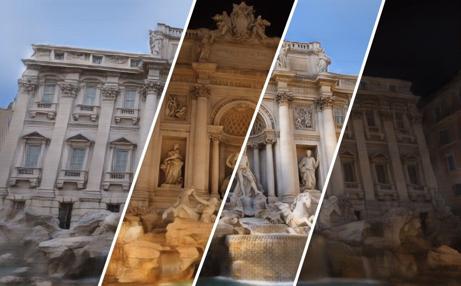
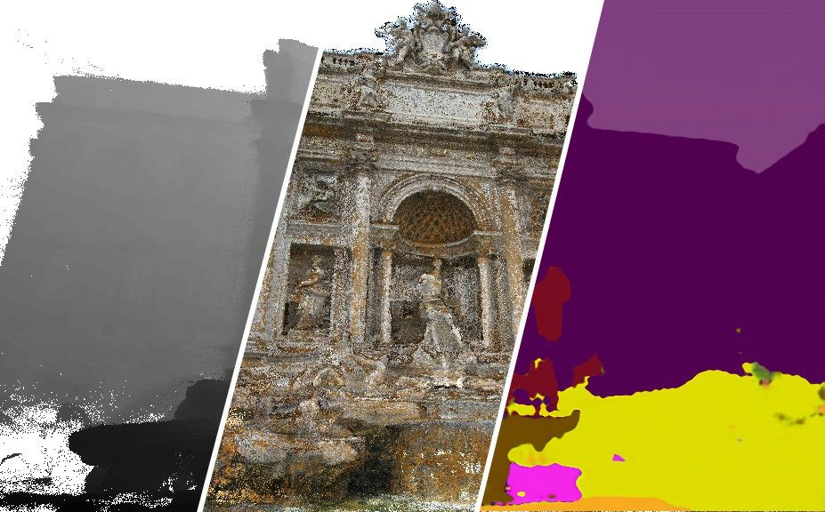

# Neural Rerendering in the Wild
Moustafa Meshry1, Dan B Goldman2, Sameh Khamis2, Hugue Hoppe2, Rohit Pandey2, Noah Snavely2, Ricardo Martin-Brualla2.

1University of Maryland, College Park &nbsp;&nbsp;&nbsp;&nbsp; 2Google Inc.

To appear at CVPR 2019 (Oral).   

<figure class="image">
  <!---  --->
  
</figure>
[ | width=450px]
                                                                                                                                              
We will provide Tensorflow implementation and pretrained models for our paper soon.

**Paper** | [**Video**](https://www.youtube.com/watch?v=Mq9OCKpFaUs) | [**Code**](https://github.com/MoustafaMeshry/neural_rerendering_in_the_wild) | [**Project page**](https://moustafameshry.github.io/neural_rerendering_in_the_wild/)

### Abstract

We explore total scene capture — recording, modeling, and rerendering a scene under varying appearance such as season and time of day.
Starting from internet photos of a tourist landmark, we apply traditional 3D reconstruction to register the photos and approximate the scene as a point cloud.
For each photo, we render the scene points into a deep framebuffer,
and train a neural network to learn the mapping of these initial renderings to the actual photos.
This rerendering network also takes as input a latent appearance vector and a semantic mask indicating the location of transient objects like pedestrians.
The model is evaluated on several datasets of publicly available images spanning a broad range of illumination conditions.
We create short videos demonstrating realistic manipulation of the image viewpoint, appearance, and semantic labeling.
We also compare results with prior work on scene reconstruction from internet photos.

### Video

<!---
### Paper
--->

<!---
### Results
<figure class="image">
  
  <figcaption>(a) Input deep buffer</figcaption>
  
  <figcaption>(b) Output rerenderings</figcaption>
</figure>
<figure class="image">
  
</figure>
--->
                                                        
### Appearance variation
<figure class="image">
  
</figure>

### Appearance interpolation
<figure class="image">
  
</figure>

